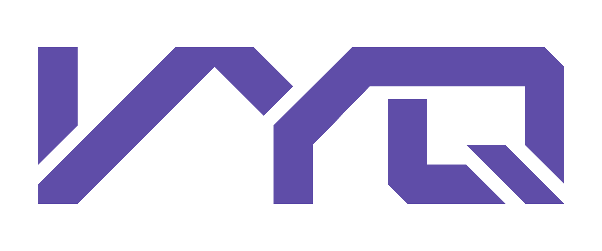

<p align="center">
    
</p>
	
vyq je imperativní, dynamicky typovaný, univerzální, stack-based interpretovaný programovací jazyk navržený s cílem sloužit jako mezistupeň mezi blokovým programováním a tradičním imperativním programováním používaným v reálných aplikacích. Jazyk je určen především pro výuku programování u dětí, aby jim ulehčil přechod od blokového programování k základům kódování používaným v praxi. Vyq je navíc open-source, což umožňuje jeho využití, modifikaci a rozšíření širší komunitou programátorů a pedagogů.

## Vlastnosti
- **Imperativní Paradigma:** Vyq podporuje sekvenční provedení příkazů pro manipulaci s daty.
- **Dynamické Typování:** Proměnné v jazyce Vyq mohou v průběhu běhu programu měnit svůj typ.
- **Automatická správa paměti** Vyq se stará o správu paměti, což odstraňuje potřebu manuálního spravování paměti a zjednodušuje proces učení.
- **Univerzálnost:** Navržen pro široké spektrum aplikací od vzdělávacích projektů až po jednoduché reálné aplikace.
- **Interpretovaný:** Kód ve Vyq je vykonáván přímo interpretem, což umožňuje rychlou iteraci a snadné testování programů.

## Instalace
1. Přejděte na [GitHub](https://github.com/simonralek/vyq) a otevřete stránku projektu.
2. Klikněte na záložku "Releases" nalezenou na stránce projektu.
3. Vyberte nejnovější verzi vhodnou pro váš operační systém a stáhněte příslušný binární soubor.
4. Po stažení soubor uložte do preferovaného umístění na vašem počítači.

## Začínáme
#### Krok 1: Vytvoření souboru

Nejprve vytvořte nový textový soubor ve vašem oblíbeném textovém editoru. Můžete ho pojmenovat například `ahoj_svete.vyq`.

#### Krok 2: Napsání kódu

Do souboru vložte následující kód:

```c
tiskni 'Ahoj, světe';
```

Tento řádek kódu využívá příkaz `tiskni` k vypsání textu `Ahoj, světe` na standardní výstup.

#### Krok 3: Spuštění programu

Uložte soubor a zavřete textový editor. Otevřete terminál nebo příkazový řádek a přejděte do složky, kde jste soubor uložili. Poté spusťte program pomocí vašeho programovacího jazyka takto:

```c
vyq cesta/k/souboru/ahoj_svete.vyq
```

Po spuštění programu byste měli vidět na obrazovce výpis:

```c
Ahoj, světe!
```

Gratulujeme, právě jste napsali a spustili svůj první program!

## Rozšíření pro VSCode
Pro lepší integraci s prostředím Visual Studio Code, můžete využít [rozšíření Vyq Language Support](https://marketplace.visualstudio.com/items?itemName=vyq.vyq-language-support), které poskytuje syntax highlighting, snippety a další funkce pro pohodlnější práci s jazykem Vyq.

## Dokumentace
Pro detailní dokumentaci přejdětě na [stránku s dokumentací](https://www.vyq.cz/dokumentace).

## Příklady Kódu
```python
konst str = 'ahoj';

opakuj prm i = 1; .i < .délka(.str); .i += 1: {
	tiskni .i;
}

konst PI = 3,14;
prm grade = 1;

prm uspech;

pokud .grade != 1: {
	.uspech = ne;
} jinak {
	.uspech = ano;
}

prm vaha = .náhoda(100);

konst binary = 0b10100;
konst hexa = 0xFF00F0;

prm idk = "
Viceradkovy
textovy retezec
";

dokud .vaha < 65 : {
	.vaha += 1;

	pokud .vaha == 60: {
		zastav;
	}
}
```

```python
// List názvů barev
prm barvy = ['červená';'zelená';'modrá'];

// Funkce pro převod barev na hexidecimální kod
funkce ziskejHexKod(barva): {
    vyber .barva: {
        pripad 'červená' -> vrat '#FF0000';
        pripad 'zelená' -> vrat '#00FF00';
        pripad 'modrá' -> vrat '#0000FF';
        jinak -> vrat 'Neznámá barva';
    }
}

prm barva =.barvy[.náhoda(2)];
tiskniB 'Pro barvu ' + .barva;
tiskni ' je hex kód: ' + .ziskejHexKod(.barva);
```

```python
prm vlhkost = 100; // Vlhkost květiny
prm dny = 1; // Počet dní

funkce snizVlhkost(uroven): {
    vrat .uroven - .náhoda(25);
}

dokud .dny <= 7: {
    .vlhkost =.snizVlhkost(.vlhkost);

    pokud .vlhkost <= 0: {
        tiskni 'Kytka vyschla na dni: ' + .dny;
        zastav;
    } jinak {
        tiskni 'Den ' + .dny + ', úroveň vlhkosti: ' + .vlhkost;
        .dny += 1;
    }
}
```

## Přispívání
Jako open-source projekt vítáme příspěvky od komunity. Zde je, jak můžete pomoci:
- **Nahlášení Chyb:** Použijte GitHub Issues pro nahlášení chyb a problémů.
- **Přispění Kódem:** Vytvořte pull request s vašimi zlepšeními nebo novými funkcemi.
- **Dokumentace:** Pomozte nám vylepšit nebo rozšířit naši dokumentaci.

## Buildování projektu

Pro build musíte mít nainstalovaný [Zig](https://ziglang.org/download/) a to ve verzi 0.12.0. Pro instalaci a následné použití doporučuji následovat [návod](https://ziglang.org/learn/getting-started/#installing-zig) na jejich oficiálních stránkách. 
Po instalaci můžete projekt buildovat pomocí příkazové řádky:

```bash
zig build
```

## Licence
Vyq je distribuován pod MIT licencí, což umožňuje široké využití a distribuci.
